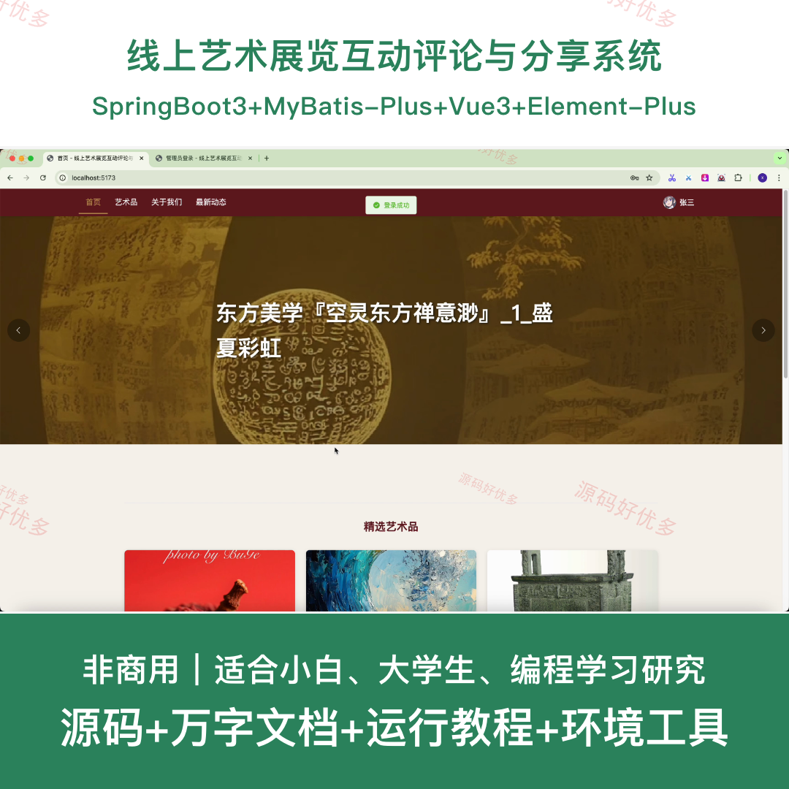
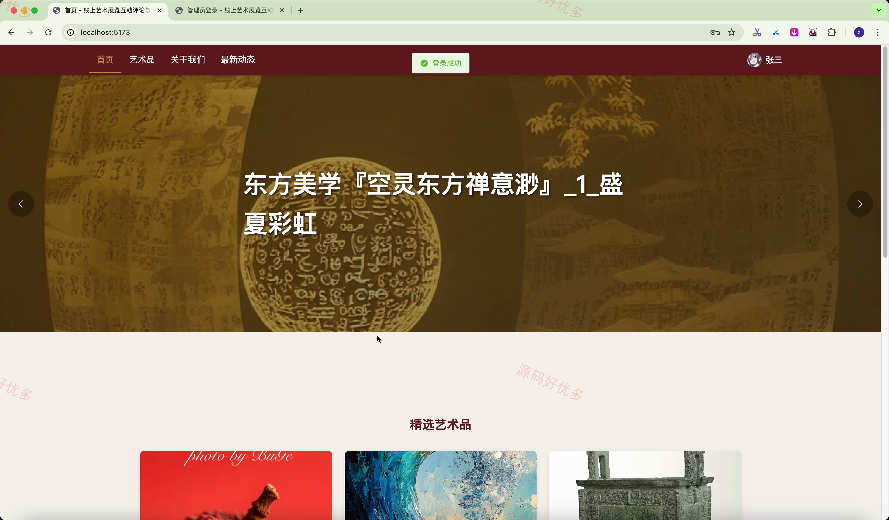
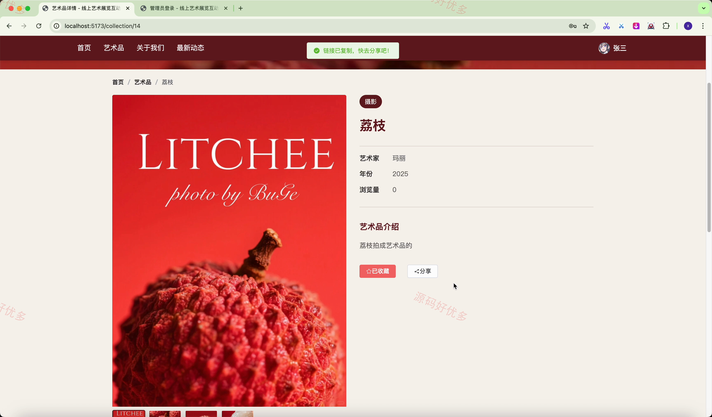
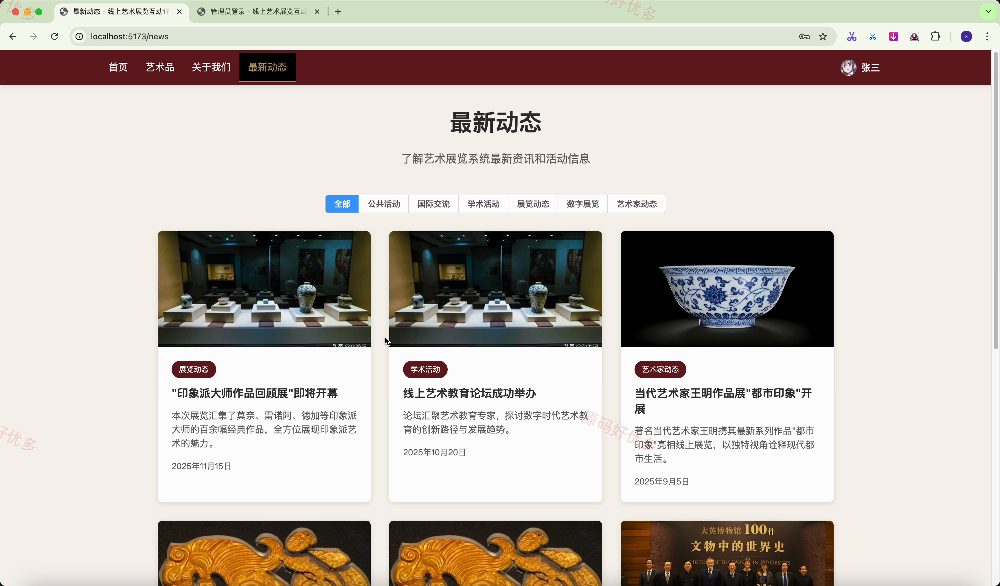
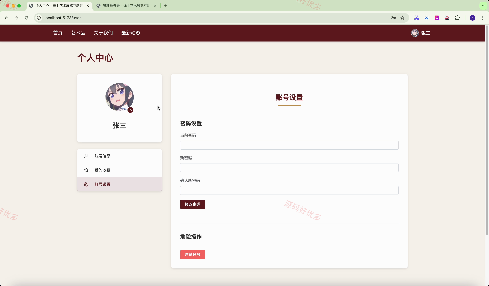
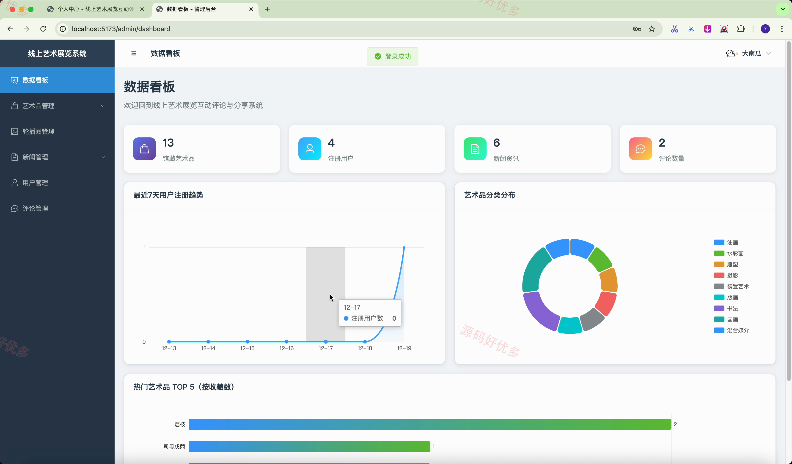
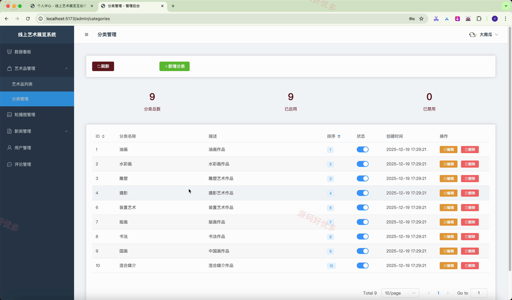
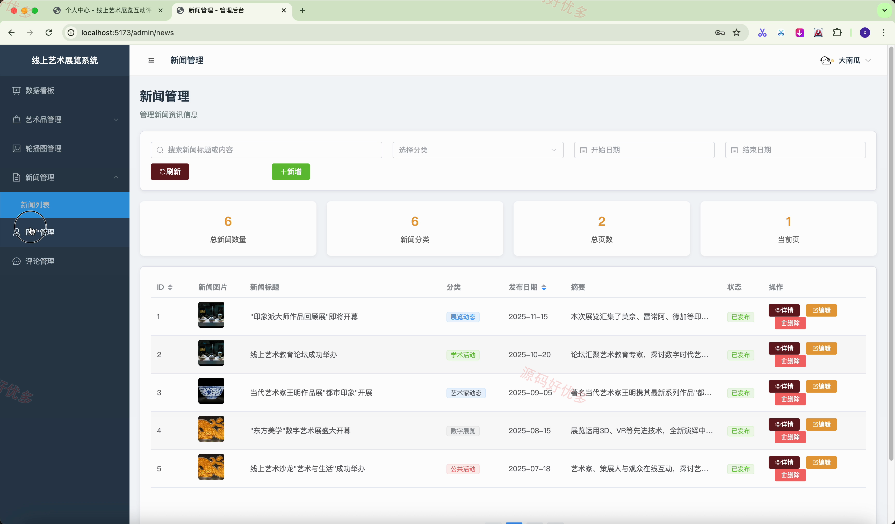
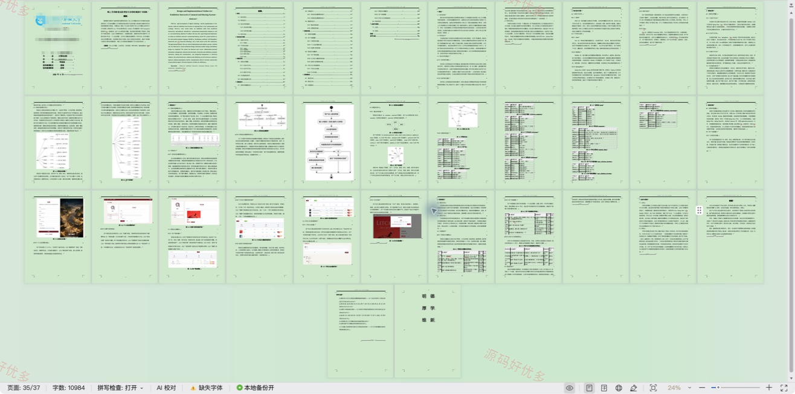

## 源码问题查看主页咨询

### 一、关键词
艺术展览、艺术品评论、展览预约、收藏分享

### 二、作品包含
源码+数据库+万字设计文档+全套环境和工具资源+本地部署教程

### 三、项目技术
前端技术： Html、Css、Js、Vue3.4、Element-Plus
后端技术：Java、SpringBoot3.3.5、MyBatis-Plus

### 四、运行环境（以下版本亲测，其他版本兼容性请自行测试）
开发工具：IDEA/eclipse + VSCODE

数据库：MySQL5.7+（共8张表）

数据库管理工具：Navicat10以上版本

环境配置软件： JDK17 + Maven3.6.3

前端Nodejs：16+

浏览器：谷歌浏览器

### 五、项目介绍
项目编号：springbootA680D

本项目面向线上艺术展览的参观用户与运营管理人员，前台提供艺术品和展览浏览、检索、评论互动、收藏分享及展览预约；后台完成艺术品、分类、轮播图、新闻、预约、用户和评论的集中管理，并通过数据看板了解运营情况。

角色：用户、管理员

用户功能：艺术品与展览浏览检索、艺术品详情查看、评论发布回复与点赞、艺术品及展览收藏分享、展览在线预约、新闻动态浏览分享、个人收藏与预约管理、个人资料维护。

管理员功能：运营数据看板、艺术品管理、艺术品分类管理、轮播图管理、新闻管理、展览预约管理、用户管理、评论管理。

### 六、运行截图

